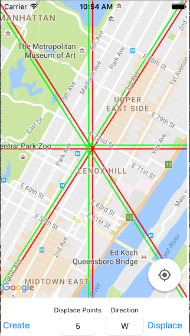
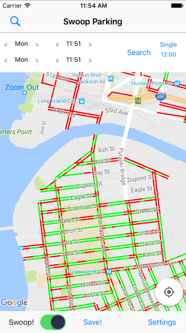

# Displace Polylines
A simple framework to displace polylines on a map. Useful for separating opposite sides of the road; I use it to display street sign data. Currently, only supports GoogleMaps, untested with curved streets

## Installation 
At this time cannot create a pod that is dependent on GoogleMaps pod, so go to 
https://github.com/dknomura/DiplacePolyline/blob/master/DisplacementOfPath/DNPolylineDisplacer.swift

Right click Raw -> Save link as

For example project

`git clone https://github.com/dknomura/DisplacePolylines.git`

## Usage
```
var yourUndisplacedPolylines: [GMSPolyline]
let polylineDisplacer = DNPolylineDisplacer()
let zoom = yourMapView.camera.zoom
let displacedPolylines = polylineDisplacer.displace(polylines: currentPolylines, xPoints: 2.0, zoom: zoom, direction: "W")
for polyline in displacedPolylines { polyline.map = yourMapView }
```

If separating two sides of a street, displacing each by 2.0 points allows it to show two distinct sides.  

## Examples
#### Example Project


Useful to separate opposite sides of the street to display street data.



## Example Project

An example project is included with this repo.  To run the example project, clone the repo
`git clone https://github.com/dknomura/DisplacePolylines.git` 
and run
`pod install`
from the Example directory first.

## Author

dknomura

## License

DisplacePolylines is available under the MIT license. See the LICENSE file for more info.

## Requirements
- iOS 9.3+
- Xcode 7.3.1+

